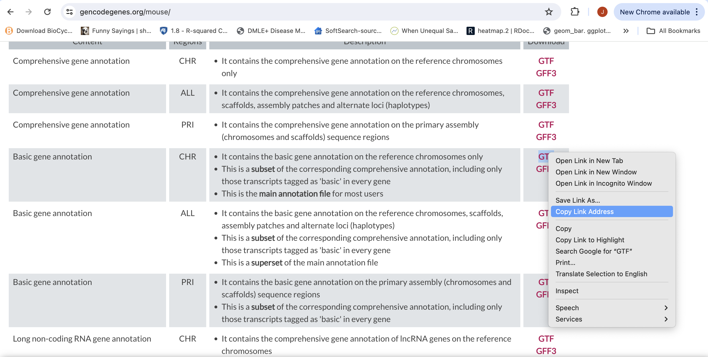

# Indexing a Reference Genome and annotation


First lets make sure we are where we are supposed to be and that the References directory is available.

```bash
cd /share/workshop/$USER/rnaseq_example
mkdir -p References
```

### Learning Objectives

1. **Locate and Identify Necessary Genome Files**:
   - Identify and retrieve the appropriate genome (FASTA) and annotation (GTF) files from GENCODE.
   - Differentiate between primary genome sequences and basic gene annotations.

2. **Explore STAR Aligner Options**:
   - Understand the purpose and usage of key STAR options like `--runThreadN`, `--runMode`, `--genomeDir`, `--genomeFastaFiles`, `--sjdbGTFfile`, and `--sjdbOverhang`.
   - Familiarize yourself with STAR documentation to understand additional features and options.

3. **Execute a STAR Indexing Job**:
   - Download and prepare the genome and annotation files using the appropriate commands.
   - Write and execute a script to index the genome using STAR.

4. **Interpret and Manage Output Files**:
   - Understand the structure and purpose of the output files generated by STAR during the genome indexing process.
   - Link to a pre-completed genome index if necessary, ensuring the integrity of the analysis.

5. **Troubleshoot Common Issues**:
   - Recognize potential issues during the indexing process and apply solutions such as linking to pre-completed indexes or re-running the job with adjustments.


## First objective is to retreive the Genome Sequence and Annotation

1. To align our data we will need the genome (fasta) and annotation (gtf) for mouse. There are many places to find them, but we are going to get them from the [GENCODE](https://www.gencodegenes.org/mouse/).

We need to first get the url for the genome and annotation gtf. For RNAseq we want to use the primary genome chromosomes and basic gene annotation. At the time of this workshop the current version of GENCODE is *M35* . You will want to update the scripts to use the current version.

We will need:

*   Genome sequence, primary assembly (GRCm39)
*   Basic gene annotation (CHR)

    

    


1. We are going to use an aligner called ['STAR'](https://www.ncbi.nlm.nih.gov/pmc/articles/PMC3530905/) to align the data. Lets take a look at the help docs for star:

```bash
STAR -h
```

The basic options to generate genome indices using STAR are as follows:

<div class="output">
    --runThreadN: number of threads  
    --runMode: genomeGenerate mode  
    --genomeDir: /path/to/store/genome_indices  
    --genomeFastaFiles: /path/to/FASTA_file  
    --sjdbGTFfile: /path/to/GTF_file  
    --sjdbOverhang: readlength -1  
</div>

*NOTE:* In case of reads of varying length, the ideal value for --sjdbOverhang is max(ReadLength)-1. In most cases, the default value of 100 will work similarly to the ideal value.

1. First we need to index the genome for STAR. Lets pull down a slurm script to index the Ensembl version of the mouse genome.


```bash
cd /share/workshop/$USER/rnaseq_example  # We'll run this from the main directory
wget https://raw.githubusercontent.com/ucsf-cat-bioinformatics/2024-08-RNA-Seq-Analysis/master/software_scripts/scripts/hts_preproc.sh
less star_index.sh
```

<pre class="prettyprint"><code class="language-py" style="background-color:333333">#!/bin/bash
#!/bin/bash

## assumes star version 2.7.11b
## assumes STAR is available on the Path

start=`date +%s`
echo $HOSTNAME

outpath="References"
mkdir -p ${outpath}

cd ${outpath}

wget https://ftp.ebi.ac.uk/pub/databases/gencode/Gencode_mouse/release_M35/GRCm39.primary_assembly.genome.fa.gz
gunzip GRCm39.primary_assembly.genome.fa.gz
FASTA="../GRCm39.primary_assembly.genome.fa"

wget wget https://ftp.ebi.ac.uk/pub/databases/gencode/Gencode_mouse/release_M35/gencode.vM35.primary_assembly.annotation.gtf.gz
gunzip gencode.vM35.primary_assembly.annotation.gtf.gz
GTF="../gencode.vM35.primary_assembly.annotation.gtf"

mkdir star.overlap100.gencode.M35
cd star.overlap100.gencode.M35

call="STAR
    --runThreadN 8 \
    --runMode genomeGenerate \
    --genomeDir . \
    --genomeFastaFiles ${FASTA} \
    --sjdbGTFfile ${GTF} \
    --sjdbOverhang 100"

echo $call
eval $call

end=`date +%s`
runtime=$((end-start))
echo $runtime
</code></pre>


When you are done, type "q" to exit.

   1. The script uses wget to download the fasta and GTF files from Gencode using the links you found earlier.
   2. Uncompresses them using gunzip.
   3. Creates the star index directory [star.overlap100.gencode.M35].
   4. Change directory into the new star index directory. We run the star indexing command from inside the directory, for some reason star fails if you try to run it outside this directory.
   5. Run star in mode genomeGenerate.


1. Run star indexing when ready.

```bash
bash star_index.sh
```

This step will take a couple hours. You can look at the [STAR documentation](https://github.com/alexdobin/STAR/blob/master/doc/STARmanual.pdf) while you wait. All of the output files will be written to the star index directory **star.overlap100.gencode.M35**.

**IF For the sake of time, or for some reason it didn't finish, is corrupted, or you missed the session, you can link over a completed copy.** If the indexing job is still running, it should be canceled first.

```bash
cd /share/workshop/$USER/
mkdir -p References; cd References
if [ -d star.overlap100.gencode.M35 ] then
    rm -rf star.overlap100.gencode.M35
fi
ln -s /share/workshop/original_dataset/References/Data/star.overlap100.gencode.M35 .
```
